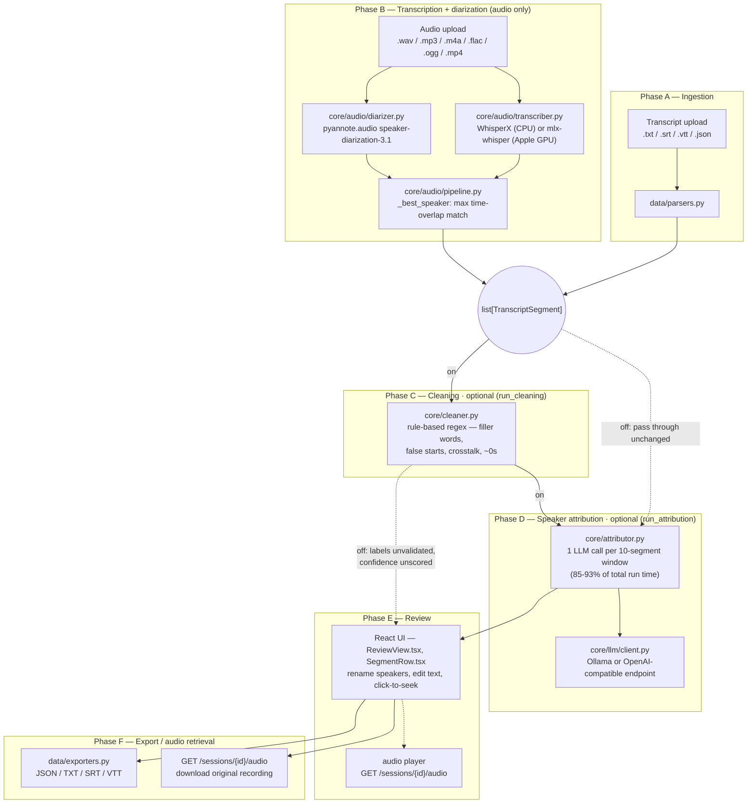

# Transcribe3 — Architecture

## Layer Boundaries

Every future contributor must understand and respect these boundaries. Violations break testability and composability.

### `src/transcribe3/core/`
Business logic only.

- No framework imports (no FastAPI, no Typer, no SQLAlchemy).
- No file I/O.
- No network calls.
- No direct model loading.
- Independently testable with mocked/injected dependencies.

This layer contains: the cleaning pipeline, attribution logic, confidence scoring, conflict detection, and alignment logic. All LLM interactions go through an injected backend interface — the model is never imported or instantiated here directly.

### `src/transcribe3/data/`
All file I/O and persistence.

- Transcript parsers (plain text, OCR output, loosely formatted transcripts).
- Session storage (read/write session state to the working directory).
- Output serializers (JSON, TXT, SRT, VTT, DOCX exporters).
- Repository pattern: data access is encapsulated behind clean interfaces, not scattered across the codebase.
- No business logic. Data layer transforms between storage representations and the canonical `TranscriptSegment` type.

The archive repository also lives in this layer. It stores only original audio on an
operator-configured external folder; `session.json`, cleaned transcripts, and session
metadata remain local. The archive path stored in a session is relative to the
configured archive root so an external drive can be mounted consistently and recordings
can be restored safely.

### `src/transcribe3/api/`
Thin FastAPI handlers.

- Calls into `core/` via service functions.
- Zero business logic inline in handlers.
- Request validation via Pydantic (from `shared/`).
- Responses serialized from types defined in `shared/`.

### `src/transcribe3/ui/`
Frontend (Phase 2+). Purely presentational.

- Receives data from the API layer only. Never calls `data/` directly.
- No business logic in components.
- State management lives in `ui/state/` and does not bleed into other layers.
- Replacement test: the entire `ui/` directory can be swapped for a different framework without requiring any changes to `core/` or `data/`.

### `src/transcribe3/shared/`
Pydantic types, enums, and constants shared across layers.

- No logic beyond Pydantic validators on the models themselves.
- The canonical `TranscriptSegment` type lives here.

### `src/transcribe3/cli.py`
Typer application. Thin shell over `core/` and `data/`.

- Zero business logic inline.
- Structured JSON output by default when stdout is not a TTY.
- Human-readable output in interactive mode.

---

## Data Flow — Phases of the Transcription Process

Both entry points (a pre-existing transcript upload, or a raw audio upload)
converge on the same cleaning → attribution → export tail. Every stage's wall
time is recorded to `session.stage_timings` and shown per-run (and averaged
across recent runs) on the Admin screen; a session predating that feature
shows "—" instead.

### Phase A — Ingestion

Two alternative entry points, chosen by which upload endpoint the client calls:

```
Transcript file (.txt/.srt/.vtt/…)          Audio file (.wav/.mp3/.m4a/…)
    │                                            │
    ▼                                            ▼
data/parsers                              core/audio/pipeline (Phase B below)
    │                                            │
    └──────────────────► list[TranscriptSegment] ◄──────────────────┘
```

`POST /sessions` handles the transcript path synchronously. `POST
/sessions/upload-audio` handles the audio path as a background task — the
client polls `GET /sessions/{id}` and watches `processing_stage` for progress
text (e.g. "Transcribing audio…", "Diarizing speakers…") while it runs.

### Phase B — Audio transcription and diarization (audio uploads only)

```
Audio file
    │
    ▼
core/audio/transcriber ──► faster-whisper via WhisperX (default),
    │                       or mlx-whisper on Apple Silicon ("mlx" backend)
    │                       ──► raw segments (start, end, text)
    ▼
core/audio/diarizer ──► pyannote.audio speaker-diarization-3.1
    │                    ──► speaker-cluster time ranges (SPEAKER_00, SPEAKER_01, …)
    ▼
core/audio/pipeline._best_speaker ──► assigns each transcript segment the
                                       diarized speaker with maximum time overlap
    │
    ▼
list[TranscriptSegment] (anonymous speaker IDs, confidence fixed at 0.8)
```

Both the Whisper model size (`tiny`…`large-v3`) and the transcription backend
(`whisperx` / `mlx`) are request parameters, not hardcoded — set per-upload
from the UI's upload form.

### Phase C — Cleaning (optional, both paths)

```
list[TranscriptSegment] ──► core/cleaner ──► normalize whitespace/punctuation,
                             filler-word handling (off/flag/strip),
                             false-start removal, crosstalk handling
                             ──► cleaned segments
```

Switched off entirely via the `run_cleaning` setting (Settings screen). When
off, this phase is skipped and segments pass through unchanged — no warning
is attached, since cleaning is cosmetic rather than a correctness signal.

### Phase D — Speaker attribution (optional, both paths)

```
cleaned segments ──► core/attributor ──► one LLM call per ~10-segment window,
                      validating/relabeling speakers and scoring confidence
                      ──► attributed segments (named speakers, scored confidence)
```

Switched off via the `run_attribution` setting. When off, the diarization or
parser's original speaker labels stand as-is and confidence is *unscored* —
the UI shows "not scored" rather than a percentage, and the session carries a
warning saying attribution was skipped. If the LLM provider is unreachable or
errors mid-run, the same warning path fires rather than discarding the
otherwise-complete transcription; diarization/parser labels are kept.

Any configured LLM backend (Ollama or an OpenAI-compatible endpoint) is
injected at call time — see "LLM Backend as Injected Dependency" below.

### Phase E — Review

The web UI's Review screen is where a human confirms or corrects what the
automated phases produced: renaming anonymous speakers to real names (which
also updates `speaker_map` and future segments sharing that ID), editing
segment text, and — for audio sessions — jumping playback to a segment's
timestamp via the embedded `<audio>` player (`GET /sessions/{id}/audio`).
Low-confidence segments (below the configurable threshold) are flagged for
review; segments from a skipped attribution phase are unscored rather than
flagged.

### Phase F — Export and audio retrieval

```
final segments ──► data/exporters ──► JSON / TXT / SRT / VTT (DOCX planned, Phase 3)
```

`GET /sessions/{id}/export?format=…` renders the current segment state to a
downloadable file on demand — nothing is pre-rendered at save time. For audio
sessions, the original source audio itself can be downloaded independently of
any transcript format via `GET /sessions/{id}/audio` (the session list's
"Audio" button sets `download` on the link so the browser saves rather than
navigates); the same endpoint backs the Review screen's inline player.

Recordings can optionally be moved to external archive storage after review
(see `data/archive` below) — this happens outside the pipeline above and does
not change any segment data.

### Pipeline Diagram



Solid arrows are the data flow; dashed arrows are the skip path taken when an
optional stage (`run_cleaning` / `run_attribution`) is switched off in
Settings. `data/session.py` (`SessionRepository`) persists `session.json`
after every stage transition, independent of what's shown above.

---

## LLM Backend as Injected Dependency

The LLM backend (Ollama-hosted model, or optionally the Claude API for benchmarking) is **always injected as a dependency**. It is never imported directly in `core/`.

This design decision (see ADR-005 in `DECISIONS.md`) enables:

- Swapping models without touching core logic.
- Benchmarking the same pipeline against multiple LLM backends.
- Testing `core/` with a mock backend that returns deterministic responses.

The model name is always a runtime parameter, never a hardcoded constant.

---

## CLI and API as Parallel Shells

The CLI (`cli.py`) and the API (`api/`) are parallel, thin entry points over the same `core/` pipeline. Neither contains business logic. A feature added to `core/` is immediately available to both interfaces without duplication.

```
transcribe3 CLI (Typer)
    │
    ├──► core/ pipeline
    │
FastAPI handlers
    │
    └──► core/ pipeline
```

For external recording storage, the API adds a separate management path:

```
local session audio ──► data/archive (copy + SHA-256 verification) ──► external archive
       ▲                                                                    │
       └────────────────────── restore (copy + verification) ───────────────┘
```

An offload removes the local source only after the external copy verifies. Local-only
deletion is permitted only when the stored archive copy is present and has the same
content hash.
